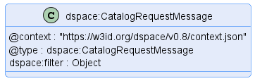
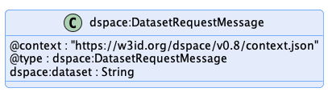
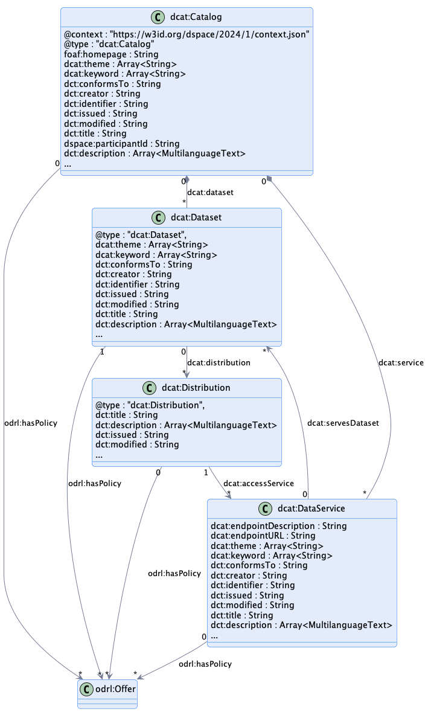
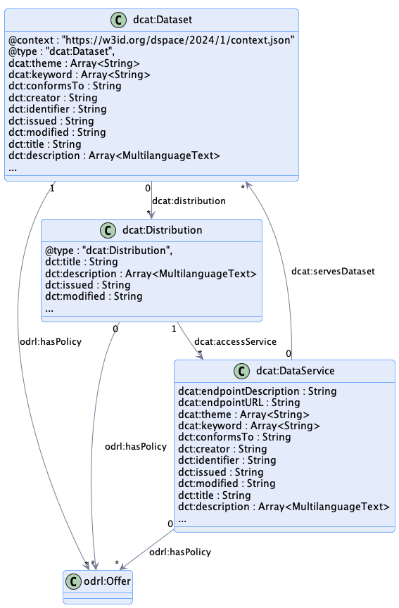
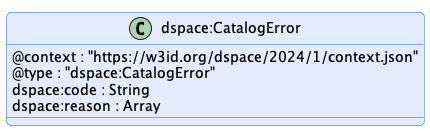

# Catalog Protocol

This document outlines the [=Catalog Protocol=]. The used terms are described in section [[[#terminology]]].

## Introduction

The Catalog Protocol defines how a [=Catalog=] is requested from a [=Catalog Service=] by a [=Consumer=] using an
abstract message exchange format. The concrete message exchange wire format is defined in the binding specifications.

The [=Catalog Protocol=] reuses properties from the DCAT and ODRL vocabularies with restrictions defined in this
specification. This is done implicitly by the use of the JSON schemas and JSON-LD-contexts that are part of the DSP.
Servers have no obligation to process properties that are not part of the schemas.

## Message Types

### Catalog Request Message

|                     |                                                                                               |
|---------------------|-----------------------------------------------------------------------------------------------|
| **Sent by**         | [=Consumer=]                                                                                  |
| **Resulting state** | `TERMINATED`                                                                                  |
| **Response**        | [ACK](#ack-catalog) or [ERROR](#error-catalog-error)                                          |
| **Schema**          | [JSON Schema](../../artifacts/src/main/resources/catalog/catalog-request-message-schema.json) |
| **Example**         | [Message](../../artifacts/src/main/resources/catalog/example/catalog-request-message.json)    |
| **Diagram(s)**      |                     |

The Catalog Request Message is message sent by a [=Consumer=] to
a [=Catalog Service=].
The [=Catalog Service=] must respond with a [Catalog](#ack-catalog) that adheres to the schema linked above.

- The message may have a `filter` property which contains an implementation-specific query or filter expression type
  supported by the [=Catalog Service=].

- The [=Catalog Service=] may require an authorization token. Details for
  including that token can be found in the protocol binding, e.g., [Catalog HTTPS Binding](#catalog-https-binding).
  Similarly, pagination may be defined in the protocol binding.

### Dataset Request Message

|                     |                                                                                               |
|---------------------|-----------------------------------------------------------------------------------------------|
| **Sent by**         | [=Consumer=]                                                                                  |
| **Resulting state** | `TERMINATED`                                                                                  |
| **Response**        | [ACK](#ack-catalog) or [ERROR](#error-catalog-error)                                          |
| **Schema**          | [JSON Schema](../../artifacts/src/main/resources/catalog/dataset-request-message-schema.json) |
| **Example**         | [Message](../../artifacts/src/main/resources/catalog/example/dataset-request-message.json)    |
| **Diagram(s)**      |                                               |

The Dataset Request Message is message sent by a [=Consumer=] to
a [=Catalog Service=].
The [=Catalog Service=] must respond with a [Dataset](#ack-dataset) that adheres to the schema linked above.

- The message must have a `dataset` property which contains the id of the [=Dataset=].

- The [=Catalog Service=] may require an authorization token. Details for
  including that token can be found in the protocol binding, e.g., [Catalog HTTPS Binding](#catalog-https-binding).

## Response Types

The `ACK` and `ERROR` response types are mapped onto a protocol such as HTTPS. A description of an error might be
provided in protocol-dependent forms, e.g., for an HTTPS binding in the request or response body.

### ACK - Catalog

|                |                                                                                    |
|----------------|------------------------------------------------------------------------------------|
| **Sent by**    | [=Provider=]                                                                       |
| **Schema**     | [JSON Schema](../../artifacts/src/main/resources/catalog/catalog-schema.json)      |
| **Example**    | [Catalog Example](../../artifacts/src/main/resources/catalog/example/catalog.json) |
| **Diagram(s)** |                                                    |

The [=Catalog=] contains all [Datasets](#dataset) which the requester shall see.

### ACK - Dataset

|                |                                                                                    |
|----------------|------------------------------------------------------------------------------------|
| **Sent by**    | [=Provider=]                                                                       |
| **Schema**     | [JSON Schema](../../artifacts/src/main/resources/catalog/dataset-schema.json)      |
| **Example**    | [Dataset Example](../../artifacts/src/main/resources/catalog/example/dataset.json) |
| **Diagram(s)** |                                                    |

### ERROR - Catalog Error

|                |                                                                                     |
|----------------|-------------------------------------------------------------------------------------|
| **Sent by**    | [=Consumer=], [=Provider=]                                                          |
| **Schema**     | [JSON Schema](../../artifacts/src/main/resources/catalog/catalog-error-schema.json) |
| **Example**    | [Error](../../artifacts/src/main/resources/catalog/example/catalog-error.json)      |
| **Diagram(s)** |                                               |

A Catalog Error is used when an error occurred after a [Catalog Request Message](#catalog-request-message) or
a [Dataset Request Message](#dataset-request-message) and the [=Provider=] cannot
provide its [=Catalog=] to the requester.

| Field     | Type          | Description                                                 |
|-----------|---------------|-------------------------------------------------------------|
| `code`    | String        | An optional implementation-specific error code.             |
| `reasons` | Array[object] | An optional array of implementation-specific error objects. |

## Technical Considerations

### Queries and Filter Expressions

A [=Catalog Service=] may support [=Catalog=] queries or filter expressions as an
implementation-specific feature. However, it is expected that query capabilities will be implemented by
the [=Consumer=] against the results of
a [Catalog Request Message](#catalog-request-message), as the latter is an RDF vocabulary. Client-side querying can
be scaled by periodically crawling
the [=Provider=]'s [=Catalog Services=], caching
the results, and executing queries against the locally-stored [=Catalogs=].

### Replication Protocol

The [=Catalog Protocol=] is designed to be used by federated services without the need for a replication protocol.
Each [=Consumer=] is responsible for issuing requests to
1..N [=Catalog Services=], and managing the results. It follows that a specific
replication protocol is not needed, or more precisely, each [=Consumer=] replicates data
from catalog services by issuing [Catalog Request Messages](#catalog-request-message).

The discovery protocol adopted by a particular [=Dataspace=] defines how
a [=Consumer=] discovers [=Catalog Services=].

### Security

It is expected (although not required) that [=Catalog Services=] implement access
control. A [=Catalog=] as well as individual [=Datasets=] may be restricted to trusted
parties. The [=Catalog Service=] may
require [=Consumers=] to include a security token along with
a [Catalog Request Message](#catalog-request-message). The specifics of how this is done can be found in the relevant
protocol binding, e.g., [Catalog HTTPS Binding](#catalog-https-binding). The semantics of such tokens are not part
of this specification.

#### The Proof Metadata Endpoint

When a [=Catalog=] contains protected [=Datasets=]
the [=Provider=] has two options: include
all [=Datasets=] in the [=Catalog=] response and restrict access when a contract is
negotiated; or, require one or more proofs when the [Catalog Request](#catalog-request-message) is made and filter
the [=Datasets=] accordingly. The latter option requires a mechanism for clients to
discover the type of proofs that may be presented at request time. The specifics of proof types and presenting a proof
during a [=Catalog=] request is outside the scope of the Dataspace Protocol.
However, [=Catalog Protocol=] bindings should define a proof data endpoint for
obtaining this information.

### Catalog Brokers

A [=Dataspace=] may include Catalog Brokers. A Catalog Broker is
a [=Consumer=] that has trusted access to 1..N
upstream [=Catalog Services=] and advertises their
respective [=Catalogs=] as a
single [=Catalog Service=]. The broker is expected to honor upstream access
control requirements.
