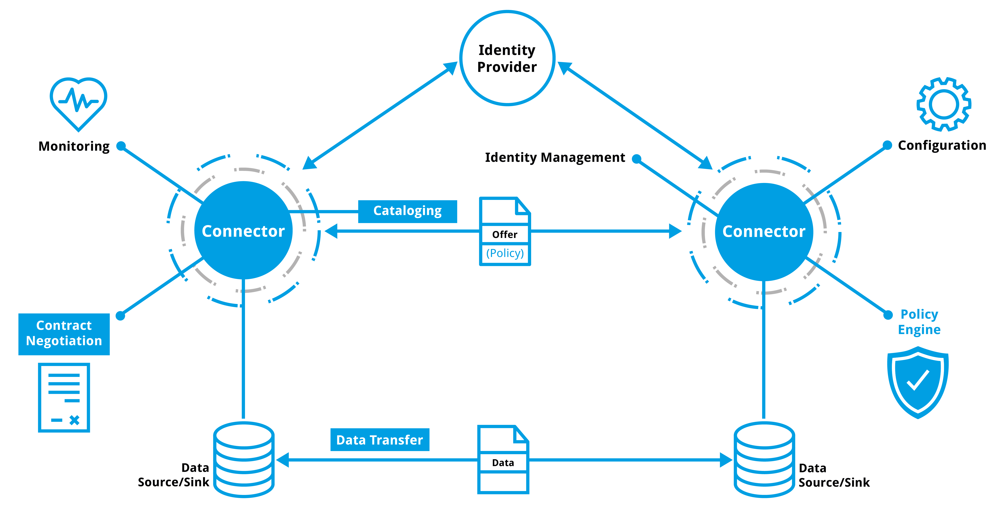

# Introduction

The __Dataspace Protocol__ is used in the context of [=Dataspaces=] as described and defined in the subsequent sections
with the purpose to support interoperability.
In this context, the specification provides fundamental technical interoperability for [=Participants=]
in [=Dataspaces=].
Beyond the technical interoperability measures described in this specification, semantic interoperability should also be
addressed by the [=Participants=]. On the perspective of the [=Dataspace=], interoperability needs to be addressed also
on the level of trust, on organizational levels, and on legal levels.
The aspect of cross-dataspace communication is not subject of this document, as this is addressed by the [=Dataspaces=]'
organizational and legal agreements.

The interaction of [=Participants=] in a [=Dataspace=] is conducted by the [=Participant Agents=],
so-called [=Connectors=], which implement the protocols described above.
While most interactions take place between [=Connectors=], some interactions with other systems are required.
The figure below provides an overview on the context of this specification.

An [=Identity Provider=] realizes the required interfaces and provides required information to implement the Trust
Framework of a [=Dataspace=].
The validation of the identity of a given [=Participant Agent=] and the validation of additional claims is a fundamental
mechanism. The structure and content of such claims and identities may, however, vary between different [=Dataspaces=],
as well as the structure of such an [=Identity Provider=], e.g. a centralized system, a decentralized system or a
federated system. Other specifications define the respective functions.

A [=Connector=] will implement additional internal functionalities, like monitoring or policy engines, as appropriate.
It is not covered by this specification if a [=Connector=] implements such or how.

The same applies for the actual data that is transferred between the systems. While this document does not define the
transport protocol, the structure, syntax or semantics of the data, a specification for those aspects is required and
subject to the agreements of the [=Participants=] or the [=Dataspace=].

