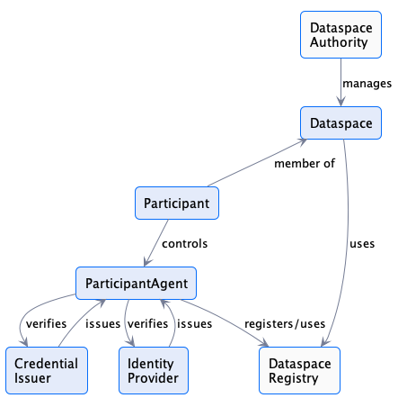
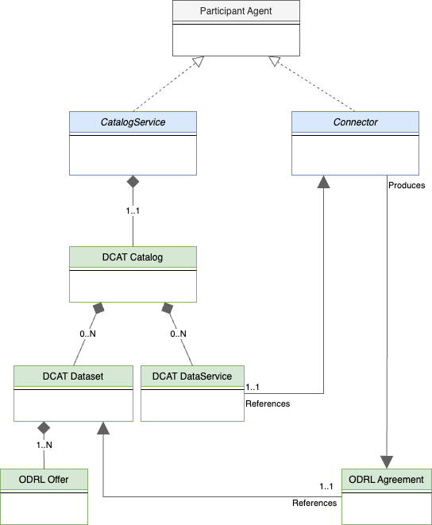

# Dataspace Information Model

The following sections outline the Dataspace Information Model, which form the foundation of this specification.
Some aspects of this section describe additional concepts of Dataspaces and provide context for the Dataspace Protocol,
those are considered as non-normative.

## Dataspace Entity Relationships

### Context of the Dataspace Protocol

In a broader context, the Dataspace Protocol enables the interaction between participants of
a Dataspace. This may require additional concepts, which are not in the scope of this specification.
The definitions below are therefore informative and not-normative.
The relationships between the primary [=Dataspace=] entities are defined as follows:

Note that all relationships are multiplicities unless specified. `Dataspace Authority` and `Dataspace Registry` are non-normative entities.

- A [=Dataspace Authority=] manages one or more [=Dataspaces=]. This will include [=Participant=] registration and may entail mandating business and/or technical requirements. For example, a [=Dataspace Authority=] may require [=Participants=] to obtain some form of business certification. A [=Dataspace Authority=] may also impose technical requirements such as support for the technical enforcement of specific usage policies.
- A [=Dataspace Registry=] records dataspace participants.
- A [=Participant=] is a member of one or more [=Dataspaces=]. A [=Participant=] registers [=Participant Agents=] that perform tasks on its behalf.
- A [=Participant Agent=] performs tasks such as publishing a [=Catalog=] or engaging in a [=Transfer Process=]. In order to accomplish these tasks, a [=Participant Agent=] may use a _**verifiable presentation**_ generated from a _**credential**_ obtained from a third-party [=Credential Issuer=]. A [=Participant Agent=] may also use an _**ID token**_ issued by a third-party [=Identity Provider=]. Note that a [=Participant Agent=] is a logical construct and does not necessarily correspond to a single runtime process.
- An [=Identity Provider=] is a trust anchor that generates `ID tokens` used to verify the identity of a [=Participant Agent=]. Multiple identity providers may operate in a [=Dataspace=]. The types and semantics of ID tokens are not part of this specification. An [=Identity Provider=] may be a third-party or a [=Participant=] itself (for example, in the case of decentralized identifiers).
- A [=Credential Issuer=] issues _verifiable credentials_ used by [=Participant Agents=] to allow access to [=Datasets=] and verify usage control.

### Dataspace Protocol specific

The Dataspace Protocol shall enable the interactions between the [=Participant Agents=] in a Dataspace.
The following concepts are therefore normative.

The diagram below depicts the relationships between [=Participant Agent=] types:

- A [=Catalog Service=] is a [=Participant Agent=] that makes a [DCAT Catalog](https://www.w3.org/TR/vocab-dcat-3/#Class:Catalog) available to other [=Participants=].
- A [=Catalog=] contains one or more [=Datasets=], which are [DCAT Datasets](https://www.w3.org/TR/vocab-dcat-3/#Class:Dataset). A [=Catalog=] also contains **_at least one_** [DCAT DataService](https://www.w3.org/TR/vocab-dcat-3/#Class:Data_Service) that references a [=Connector=] where [=Datasets=] may be obtained.
- A [=Dataset=] has **_at least one_** [=Offer=], which is an [ODRL Offer](https://www.w3.org/TR/odrl-model/#policy-offer) describing the [=Usage Policy=] associated with the [=Dataset=].
- A [=Connector=] is a [=Participant Agent=] that performs [=Contract Negotiation=] and [=Transfer Process=] operations with another [=Connector=]. An outcome of a [=Contract Negotiation=] may be the production of an [=Agreement=], which is an [ODRL Agreement](https://www.w3.org/TR/odrl-model/#policy-agreement) defining the [=Usage Policy=] agreed to for a [=Dataset=].

## Classes

Not all [=Dataspace=] entities have a concrete _technical_ materialization; some entities may exist as purely logical constructs. For example, a [=Dataspace Authority=] and a [=Participant Agent=] have no representation in the protocol message flows that constitute [=Dataspace=] interactions. This section outlines the classes that comprise the concrete elements of the model, i.e., those that are represented in protocol message flows.

**_Note 1:_**
The classes and definitions used in the Dataspace Protocol are reused from different standards and specifications as much as possible, in particular, DCAT [[vocab-dcat-3]] and ODRL [[odrl-model]]. As, however, the external definitions allow different interpretations or provide more attributes than required, the Dataspace Protocol is leveraging _profiles_ of the original definitions rather than the complete original expressiveness. A _profile_ in this sense is a restriction or subset of an external definition, enforcing that every occurrence of an externally defined class is always conformant with the original definition. However, not every standard-compliant class might be compliant to the dataspace profile.

### Catalog

A [=Catalog=] is a [DCAT Catalog](https://www.w3.org/TR/vocab-dcat-3/#Class:Catalog) with the following attributes:

- 0..N [=Datasets=]. Since a [=Catalog=] may be dynamically generated for a request based on the requesting [=Participant=]'s credentials it is possible for it to contain 0 matching [=Datasets=]. (DCAT PROFILE)
- 1..N [DCAT DataService](https://www.w3.org/TR/vocab-dcat-3/#Class:Data_Service) that references a [=Connector=] where [=Datasets=] may be obtained. (DCAT PROFILE)

### Dataset

A [=Dataset=] is a [DCAT Dataset](https://www.w3.org/TR/vocab-dcat-3/#Class:Dataset) with the following attributes:

- 1..N `hasPolicy` attributes that contain an [ODRL Offer](https://www.w3.org/TR/odrl-vocab/#term-Offer) defining the [=Usage Policy=] associated with the [=Dataset=]. **_Offers must NOT contain any target attributes. The target of an [=Offer=] is the associated [=Dataset=]._** (ODRL PROFILE)
- 1..N [DCAT Distributions](https://www.w3.org/TR/vocab-dcat-3/#Class:Distribution). Each distribution must have at least one `DataService` which specifies where the distribution
  is obtained. Specifically, a `DataService` specifies the endpoint for initiating a [=Contract Negotiation=] and [=Transfer Process=]. (DCAT PROFILE)

### Offer

An [=Offer=] is an [ODRL Offer](https://www.w3.org/TR/odrl-model/#policy-offer) with the following attributes:

- An ODRL `uid` is represented as an "@id" that is a unique identifier. (ODRL PROFILE)
- The [=Offer=] must be unique to a [=Dataset=] since the target of the [=Offer=] is derived from its enclosing context.
- The value of the `target` attribute is the dataset id. Except if the [Offer][Catalog](terminology.md#offer) is used in an enclosing [=Catalog=] or [=Dataset=], then the there must not be any `target` attribute set.

### Agreement

An [=Agreement=] is an [ODRL Agreement](https://www.w3.org/TR/odrl-model/#policy-agreement) with the following attributes:

- The [=Agreement=] class must include one `target` attribute that is the identifier of the [=Dataset=] the [=Agreement=] is associated with. An [=Agreement=] is therefore associated with **EXACTLY ONE** [=Dataset=]. (ODRL PROFILE)
