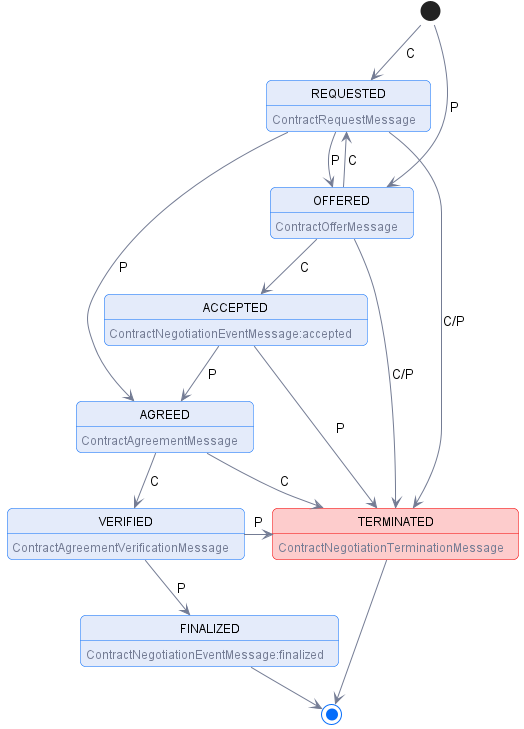

# Contract Negotiation Protocol {#negotiation-protocol}

## Introduction

A [=Contract Negotiation=] involves two parties, a [=Provider=] that offers one or more [=Datasets=] along with a [=Policy=] 
and a [=Consumer=] that requests [=Datasets=]. A [=Contract Negotiation=] is uniquely identified through an Internationalized Resource Identifier (IRI) [[rfc3987]]. Each [=Contract Negotiation=]
requires a newly generated IRI, which MAY not be used in a [=Contract Negotiation=] after a terminal state has been reached. A [=Contract Negotiation=] progresses
through a series of states, which are tracked by the [=Provider=] and [=Consumer=] using [=Messages=]. A [=Contract Negotiation=] transitions to a
state in response to an acknowledged [=Message=] from the counter-party. Both parties have the same state of the [=Contract Negotiation=]. In case
the states differ, the [=Contract Negotiation=] MUST be terminated and a new [=Contract Negotiation=] MAY be initiated.

### States {#contract-negotiation-states}

The [=Contract Negotiation=] states are:

- **REQUESTED**: An [=Agreement=] for a [=Dataset=] has been requested by the [=Consumer=] based on an [=Offer=] and
  the [=Provider=] has sent an ACK response.
- **OFFERED**: The [=Provider=] has sent an [=Offer=] to the [=Consumer=] and the [=Consumer=] has sent an ACK response.
- **ACCEPTED**: The [=Consumer=] has accepted the latest [=Offer=] and the [=Provider=] has sent an ACK response.
- **AGREED**: The [=Provider=] has accepted the latest [=Offer=], sent an [=Agreement=] to the [=Consumer=], and
  the [=Consumer=] has sent an ACK response.
- **VERIFIED**: The [=Consumer=] has sent an [=Agreement=] verification to the [=Provider=] and the [=Provider=] has
  sent an ACK response.
- **FINALIZED**: The [=Provider=] has sent a finalization [=Message=] including his own [=Agreement=] verification to
  the [=Consumer=] and the [=Consumer=] has sent an ACK response. Data is now available to the [=Consumer=].
- **TERMINATED**: The [=Provider=] or [=Consumer=] has placed the [=Contract Negotiation=] in a terminated state. A termination [=Message=] has
  been sent by either of the [=Participants=] and the other has sent an ACK response. This is a terminal state.

### State Machine

The [=Contract Negotiation=] state machine is represented in the following diagram:

Transitions marked with `C` indicate a [=Message=] sent by the [=Consumer=], transitions marked with `P` indicate
a [=Provider=] [=Message=]. Terminal states are final; the state machine MUST NOT transition to another state. A new [=Contract Negotiation=] MAY be initiated if, for instance, the [=Contract Negotiation=] entered the `TERMINATED` state due to a network issue.

## Message Types

The [=Contract Negotiation=] state machine is transitioned upon receipt and acknowledgement of a [=Message=]. This section details those [=Messages=] as abstract [=Message Types=].

- Concrete wire formats are defined by the protocol binding,
  e.g., [Contract Negotiation HTTPS Binding](#contract-negotiation-https-binding).

- All [=Policy=] types ([=Offer=], [=Agreement=]) MUST contain a unique identifier in the form of a URI. Globally Unique Identifiers (GUIDs) MAY also
  be used in the form of Uniform Resource Names (URNs), for instance following the pattern <urn:uuid:{GUID}>.

- An [=Agreement=] MUST have a `target` property containing the [=Dataset=] identifier.

### Contract Request Message

|                     |                                                                                                                                     |
|---------------------|-------------------------------------------------------------------------------------------------------------------------------------|
| **Sent by**         | [=Consumer=]                                                                                                                        |
| **Resulting state** | `REQUESTED`, `TERMINATED`                                                                                                           |
| **Response**        | [ACK](#ack-contract-negotiation) or [ERROR](#error-contract-negotiation-error)                                                      |
| **Schema**          | [JSON Schema](message/schema/contract-request-message-schema.json)                                                                  |
| **Example**         | Initiating [Message](message/example/contract-request-message_initial.json), [Message](message/example/contract-offer-message.json) |
| **Properties**      | 

                                         |

The Contract Request Message is sent by a [=Consumer=] to initiate a [=Contract Negotiation=] or to respond to
a [Contract Offer Message](#contract-offer-message) sent by a [=Provider=].

- The [=Consumer=] MUST include an `offer` property, which itself MUST have a `@id` property. If the message includes
  a `providerPid` property, the request MUST be associated with an existing [=Contract Negotiation=] and a [=Consumer=] [=Offer=]  MUST be
  created using either the `offer` or `offer.@id` properties. If the message does not include a `providerPid`, a new [=Contract Negotiation=]
  MUST be created on [=Provider=] side using either the `offer` or `offer.@id` properties and the [=Provider=] MUST select
  an appropriate `providerPid`.

- An `offer.@id` MUST generally refer to an [=Offer=] contained in a [=Catalog=]. If the [=Provider=] is not aware of
  the `offer.@id` value, it MUST respond with an error message.

- `offer.obligation` and `offer.permission` signify the terms at which a [=Consumer=] would accept an [=Offer=]. 

- The `callbackAddress` is a URL indicating where messages to the [=Consumer=] SHOULD be sent in asynchronous settings.
  If the address is not understood, the [=Provider=] MUST return an **unrecoverable** error.

- Different to a [=Catalog=] or [=Dataset=], the [=Offer=] inside
  a [Contract Request Message](#contract-request-message) MUST have a `target` attribute. However, it's contained
  Rules MUST not have any `target` attributes to prevent inconsistencies with
  the [ODRL inferencing rules for compact policies](https://www.w3.org/TR/odrl-model/#composition-compact).

### Contract Offer Message

|                     |                                                                                                                                                |
|---------------------|------------------------------------------------------------------------------------------------------------------------------------------------|
| **Sent by**         | [=Provider=]                                                                                                                                   |
| **Resulting state** | `OFFERED`, `TERMINATED`                                                                                                                        |
| **Response**        | [ACK](#ack-contract-negotiation) or [ERROR](#error-contract-negotiation-error)                                                                 |
| **Schema**          | [JSON Schema](message/schema/contract-offer-message-schema.json)                                                                               |
| **Example**         | [Example Initial Message](message/example/contract-offer-message_initial.json), [Example Message](message/example/contract-offer-message.json) |
| **Properties**      | 

                                                      |

The Contract Offer Message is sent by a [=Provider=] to initiate a [=Contract Negotiation=] or to respond to
a [Contract Request Message](#contract-request-message) sent by a [=Consumer=].

- If the message includes a `consumerPid` property, the request MUST be associated with an existing [=Contract Negotiation=]. If the message does not include a `consumerPid`, a new [=Contract Negotiation=] MUST be created on [=Consumer=] side and the [=Consumer=] selects an appropriate `consumerPid`.

- The [=Dataset=] identifier MAY be included when the [=Provider=] initiates a [=Contract Negotiation=].

- Different to a [=Dataset=],
  the [=Offer=] inside a [Contract Offer Message](#contract-offer-message) MUST have a `target` attribute. However, its contained Rules MUST not
  have any `target` attributes to prevent inconsistencies with
  the [ODRL inferencing rules for compact policies](https://www.w3.org/TR/odrl-model/#composition-compact).

- If the message initiates a [=Contract Negotiation=], it MUST contain a `callbackAddress` property indicating where messages to the [=Provider=] SHOULD be sent in asynchronous settings.
  If the address is not understood, the [=Consumer=] MUST return an **unrecoverable** error.

### Contract Agreement Message

|                     |                                                                                               |
|---------------------|-----------------------------------------------------------------------------------------------|
| **Sent by**         | [=Provider=]                                                                                  |
| **Resulting state** | `AGREED`, `TERMINATED`                                                                        |
| **Response**        | [ACK](#ack-contract-negotiation) or [ERROR](#error-contract-negotiation-error)                |
| **Schema**          | [JSON Schema](message/schema/contract-agreement-message-schema.json)                          |
| **Example**         | [Message](message/example/contract-agreement-message.json)                                    |
| **Properties**      | 

 |

The Contract Agreement Message is sent by a [=Provider=] when it agrees to a [=Policy=]. It contains the
complete [=Agreement=].

- The message MUST contain a `consumerPid` and a `providerPid`.

- The message MUST contain an [=Agreement=].

- An [=Agreement=] MUST contain a `timestamp` property defined as an [XSD DateTime](https://www.w3schools.com/XML/schema_dtypes_date.asp) type.

- An [=Agreement=] MUST contain an `assigner` and `assignee`. The contents of these properties are a dataspace-specific
  unique identifier of the [=Agreement=] parties. These identifiers MAY be the same as the
  identifiers of the [=Participant Agents=] negotiating the [=Agreement=] (e.g., [=Connectors=]).

- An [=Agreement=] MUST contain a `target` property. None of its Rules, however, MUST have any `target`
  attributes to prevent inconsistencies with
  the [ODRL inferencing rules for compact policies](https://www.w3.org/TR/odrl-model/#composition-compact).

### Contract Agreement Verification Message

|                     |                                                                                                           |
|---------------------|-----------------------------------------------------------------------------------------------------------|
| **Sent by**         | [=Consumer=]                                                                                              |
| **Resulting state** | `VERIFIED`, `TERMINATED`                                                                                  |
| **Response**        | [ACK](#ack-contract-negotiation) or [ERROR](#error-contract-negotiation-error)                            |
| **Schema**          | [JSON Schema](message/schema/contract-agreement-verification-message-schema.json)                         |
| **Example**         | [Message](message/example/contract-agreement-verification-message.json)                                   |
| **Properties**      | 

 |

The Contract Agreement Verification Message is sent by a [=Consumer=] to verify the acceptance of an [=Agreement=].

- A [=Provider=] MUST respond with an error if the [=Agreement=] cannot be validated or is incorrect.

- The message MUST contain a `consumerPid` and a `providerPid`.

### Contract Negotiation Event Message

|                     |                                                                                                      |
|---------------------|------------------------------------------------------------------------------------------------------|
| **Sent by**         | [=Consumer=], [=Provider=]                                                                           |
| **Resulting state** | `FINALIZED`, `ACCEPTED`, `TERMINATED`                                                                |
| **Response**        | [ACK](#ack-contract-negotiation) or [ERROR](#error-contract-negotiation-error)                       |
| **Schema**          | [JSON Schema](message/schema/contract-negotiation-event-message-schema.json)                         |
| **Example**         | [Message](message/example/contract-negotiation-event-message.json)                                   |
| **Properties**      | 

 |

When the Contract Negotiation Event Message is sent by a [=Provider=] with an `eventType` property set to `FINALIZED`,
an [=Agreement=] has been finalized and the associated [=Dataset=] is accessible. The state machine is transitioned to
the `FINALIZED` state.

- Other event types may be defined in the future.

- A [=Consumer=] MUST respond with an error if the [=Agreement=] cannot be validated or is incorrect.

- The message MUST contain a `consumerPid` and a `providerPid`.

- When the message is sent by a [=Consumer=] with an `eventType` set to `ACCEPTED`, the state machine MUST be placed in
  the `ACCEPTED` state.

- It is an error for a [=Consumer=] to send the message with an event type `FINALIZED` to the [=Provider=].

- It is an error for a [=Provider=] to send the message with an event type `ACCEPTED` to the [=Consumer=].

Note that [=Contract Negotiation=] events are not intended for propagation of an [=Agreement=] state after a [=Contract Negotiation=] has entered a terminal state.
[=Consumer=] or [=Provider=] MUST NOT send an event after the [=Contract Negotiation=] state machine has entered a
terminal state. If they do so, this event MUST be handled as error.

### Contract Negotiation Termination Message

|                     |                                                                                                            |
|---------------------|------------------------------------------------------------------------------------------------------------|
| **Sent by**         | [=Consumer=], [=Provider=]                                                                                 |
| **Resulting state** | `TERMINATED`                                                                                               |
| **Response**        | [ACK](#ack-contract-negotiation) or [ERROR](#error-contract-negotiation-error)                             |
| **Schema**          | [JSON Schema](message/schema/contract-negotiation-termination-message-schema.json)                         |
| **Example**         | [Message](message/example/contract-negotiation-termination-message.json)                                   |
| **Properties**      | 

 |

The Contract Negotiation Termination Message is sent by a [=Consumer=] or [=Provider=] indicating it has cancelled the
[=Contract Negotiation=] sequence. The message MAY be sent at any state of a [=Contract Negotiation=] without providing an explanation. Nevertheless, the sender MAY
provide a description to help the receiver.

- The message MUST contain a `consumerPid` and a `providerPid`.

- If an error is received in response to the message, the sending party MAY choose to ignore the error.

Note that a [=Contract Negotiation=] may be terminated for a variety of reasons, for example, an unrecoverable error was encountered or one of
the parties no longer wishes to continue. A [=Connector=]'s operator MAY
remove terminated [=Contract Negotiation=] resources after it has reached the terminated state.

## Response Types

The `ACK` and `ERROR` response types are mapped onto a protocol such as HTTPS. A description of an error MAY be
provided in protocol-dependent forms, e.g., for an HTTPS binding in the request or response body.

### ACK - Contract Negotiation

|                |                                                                                          |
|----------------|------------------------------------------------------------------------------------------|
| **Sent by**    | [=Consumer=], [=Provider=]                                                               |
| **Schema**     | [JSON Schema](message/schema/contract-negotiation-schema.json)                           |
| **Example**    | [Process](message/example/contract-negotiation.json)                                     |
| **Properties** | 

 |

The Contract Negotiation is an object returned by a [=Consumer=] or [=Provider=] indicating a successful state change
happened.

An [=Agreement=] contains the following attributes:

- An Agreement MUST be associated with exactly one [=Dataset=].

- An Agreement MUST include exactly one `target` attribute that is the identifier of the [=Dataset=] the [=Agreement=] is associated with.

### ERROR - Contract Negotiation Error

|                |                                                                                               |
|----------------|-----------------------------------------------------------------------------------------------|
| **Sent by**    | [=Consumer=], [=Provider=]                                                                    |
| **Schema**     | [JSON Schema](message/schema/contract-negotiation-error-schema.json)                          |
| **Example**    | [Error](message/example/contract-negotiation-error.json)                                      |
| **Properties** | 

 |

The Contract Negotiation Error is an object returned by a [=Consumer=] or [=Provider=] indicating an error has occurred.
It does not cause a state transition.